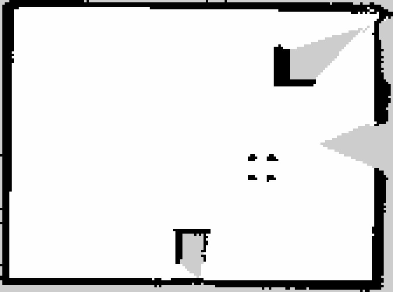

# Closed-loop mapping and saved-map localization, 2026-09-28

Companion Isaac source snapshot: `/home/nithish/projects/robotics/jetauto_isaac_sim` on the Jetson. The `scripts/` and `config/` paths below refer to that separate project.

The Jetson AMR checkout was at clean commit `34bdb13` before this run. Its new `localization_slam_mapping` package was used without changing the Jetson source. Isaac Sim 4.5 ran headless on the Windows laptop and sent standard ROS 2 messages over the available Wi-Fi Fast DDS link. No Nav2 controller or physical base driver was enabled.

## Route and map

`run_isaac.ps1 -MappingLoop -MappingLaps 2` selected a mapping-only scene: the RGB-D render product and moving pedestrian were disabled, while the 10 Hz simulated LiDAR remained active. A feedback controller moved the placeholder base around a rectangle with corners near `(-0.5, -1.0)`, `(2.6, -1.0)`, `(2.6, 1.0)`, and `(-0.5, 1.0)` metres. It used the simulator pose to adjust heading and speed at each waypoint. Odometry and `odom -> base_link` TF included both translation and yaw.

The Jetson recorded `/home/nithish/jetauto_isaac_mapping_loop_20260928`: 190.75 s wall time, 107.2 s simulation time, 1,070 scans, and 190 occupancy grids. Consecutive scan stamps were monotonic with a maximum gap of 0.101 s. Excluding one pre-drive odometry sample at the old origin, the two loops covered 19.69 m and ended 0.10 m from the route start. The first sample jump was corrected in the scene after this bag was made; the localization run below starts at the correct pose.

SLAM Toolbox produced a 168 × 125 grid at 0.05 m/cell. The map contained 2,188 occupied, 16,940 free, and 1,872 unknown cells. Strong wall bands were near x = -2.0 and 5.9 m and y = ±3.0 m, consistent with the scene's nominal walls at x = -2 and 6 m and y = ±3 m. This is a coarse geometry check, not a calibrated map error measurement.

Both SLAM Toolbox export services returned `result=0`. The saved map is on the Jetson at `/home/nithish/jetauto_isaac_maps/loop_20260928` with `.pgm`, `.yaml`, `.posegraph`, and `.data` files. The pose graph load was confirmed when starting localization.

## Saved-map localization

SLAM Toolbox's `localization_slam_toolbox_node` loaded the saved pose graph with `map_start_pose: [-0.5, -1.0, 0.0]`. A fresh one-lap Isaac run started from that pose. Its bag is `/home/nithish/jetauto_isaac_localization_20260928`: 165.96 s wall time including startup, 93.53 s simulation time, 934 scans, 157 localized `/pose` messages, and 166 map messages. Scan stamps remained monotonic with a maximum gap of 0.101 s. The robot traveled 10.12 m, turned 6.28 rad in total, and finished 0.03 m from its start.

The saved mapping bag's final `map -> odom` transform was used as a fixed alignment to compare localized `/pose` in `map` with Isaac's known `/odom/wheel` pose. All 157 poses matched an odometry timestamp within 5 ms.

| Error against Isaac pose | Median | 95th percentile | Maximum | RMSE |
| --- | ---: | ---: | ---: | ---: |
| Position | 0.058 m | 0.124 m | 0.144 m | 0.065 m |
| Heading | 0.0042 rad | 0.0140 rad | 0.0175 rad | 0.0070 rad |

These numbers validate saved-map loading, scan matching, TF publication, and pose continuity along this repeat route. The simulator odometry is exact kinematic ground truth, the same room and route were used for mapping and localization, and no wheel drift or IMU noise was injected. A distinct route, localization under odometry error, and an explicit pose-graph loop-closure check remain necessary before treating this as navigation-grade localization. Ethernet performance also remains untested because the laptop cable was disconnected.

A subsequent [controlled-odometry-drift replay](isaac_odometry_drift_2026-09-30.md)
checks saved-map localization when the incoming `odom -> base_link` TF is
biased; distinct-route and explicit loop-closure validation remain open.

## Reproduce

Start mapping on the Jetson with `ros2 launch localization_slam_mapping slam_mapping.launch.py backend:=isaac`. Start Isaac headless using `scripts/windows/run_isaac.ps1 -DomainId 42 -MappingLoop -MappingLaps 2`, or launch the PowerShell process with `-WindowStyle Hidden` as in `docs/installation.md` in the companion project. Record `/clock /scan /tf /tf_static /odom/wheel /map /map_metadata`; when `MAPPING_LOOP_COMPLETED` appears in the Isaac log, stop recording and run `scripts/linux/save_slam_map.sh /writable/map/prefix` on the Jetson with its ROS environment sourced.

For localization, stop mapping and Isaac, then start `localization_slam_toolbox_node` with `config/slam_localization_isaac.yaml` in the companion project, `use_sim_time:=true`, and `map_file_name:=/writable/map/prefix`. Start a fresh Isaac process with `-MappingLoop -MappingLaps 1`. Record `/clock /scan /tf /tf_static /odom/wheel /map /pose`. Run `scripts/linux/analyze_mapping_bag.py` on either bag and `scripts/linux/analyze_localization_bag.py localization_bag mapping_bag` for the metrics above. Both test processes were stopped after capture.
